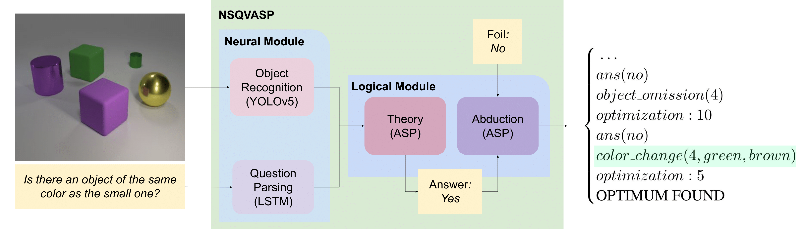

# A Logic-based Approach to Contrastive Explainability for Neurosymbolic Visual Question Answering

This repository contains the implementation of our ASP-based modular neurosymbolic framework for VQA
and our abduction program for generating Contrastive Explanations used in our paper ''A Logic-based Approach to Contrastive Explainability for Neurosymbolic Visual Question Answering'' accepted at IJCAI23.

## Abstract

Visual Question Answering (VQA) is a well-known
problem for which deep-learning is key. This poses
a challenge for explaining answers to questions, the
more if advanced notions like contrastive explana-
tions (CEs) should be provided. The latter explain
why an answer has been reached in contrast to a
different one and are attractive as they focus on rea-
sons necessary to flip a query answer. We present
a CE framework for VQA that uses a neurosym-
bolic VQA architecture which disentangles percep-
tion from reasoning. Once the reasoning part is
provided as logical theory, we use answer-set pro-
gramming, in which CE generation can be framed
as an abduction problem. We validate our approach
on the CLEVR dataset, which we extend by more
sophisticated questions to further demonstrate the
robustness of the modular architecture. While we
achieve top performance compared to related ap-
proaches, we can also produce CEs for explanation,
model debugging, and validation tasks, showing the
versatility of the declarative approach to reasoning.



## Requirements

The major software packages we used are:

1. [Python 3.8](https://www.python.org/)
2. [PyTorch 1.7.1](https://pytorch.org/)
3. [Clingo 5.6.2](https://potassco.org/clingo/)
4. [CUDA 12](https://developer.nvidia.com/cuda-downloads)

We suggest using [Conda](https://docs.conda.io/en/latest/) for packet management.
Simply install the listed packages and perform the steps described in [Setup](#setup).
Our experiments where done on a system running Ubuntu 20.04.5 LTS.

## Project Structure

```
PROJECT_NAME
│   README.md
│   infer.py                    // Inference and optionally Abduction
│   gen_ce.py                   // Contrastive Explanation generator
│   dataset.py                  // Dataset and DataLoader
│   options.py                  // Options
│   tools.py                    // Auxiliary functions
│
└───language                    // Folder containing LSTM model.
│   │   ...
│
└───vision                      // Folder containing YOLOv5 files
│   │   ...
│
└───reasoning                   // Folder containing ASP encodings of
                                // the Theory, Abduction and Examples.
    │   ...
    │
└───question_gen                // Folder containing code to generate
                                // questions given CLEVR images and scenes.
    │   ...
```

## Setup

Set up a conda enviroment and then install the requirements file using:

```
conda create -n NSVQASP
conda activate NSVQASP
conda install --file requirements.txt
```

## Reproducibility

### Data

First, the user must download the [CLEVR dataset](https://cs.stanford.edu/people/jcjohns/clevr) which contains the original images, scenes, and question files.

To generate the new questions, use the following command:
`python generate_questions.py  --input_scene_file <scene_path> --output_questions_file <output_path>  --template_dir <templates_path>`

where `scene_path` is the path to the training and validation CLEVR scenes, `output_path` is the output path where the generated questions will be placed, and `templates_path` is the path to the folder that contains the templates that are used to generate the questions.
We provide four folders with templates: extended, extended between, extended equal and extended count between folders, which we use to generate new, new between, new equal, and new cnt questions, respectively, explained in detail in the Evaluation section of our paper.
We generated the data for the experiments using the original CLEVR scenes for training and validation.

### Neural Network Training

To use the system, it is necessary to train the LSTM and YOLOv5 models.
This [page](https://github.com/kexinyi/ns-vqa) contains instructions on how to preprocess the data and train the LSTM, as well as a link to download the CLEVR mini dataset, used to train YOLOv5.
Download the CLEVR mini dataset and use it to train YOLOv5.
For instructions on how to do so, see this [link](https://github.com/ultralytics/yolov5).

### Inference

The user can invoke the following command to run the inference program on all the scene question pairs of a particular dataset, reproducing the statistics reported in the paper:

```
python infer.py
 --clevr_image_path <images_path>
 --clevr_scene_path <scene_path>
 --clevr_question_path <questions_path>
 --clevr_vocab_path <vocab_path>
 --vision_weights <YOLO_weights_path>
 --language_weights <LSTM_weights_path>
 --theory <theory_path>
```

where `images_path, scene_path>` are the paths to the images and their scene representations respectively;
`questions_path, vocab_path` are the paths to the questions and the vocabulary in h5 format;
`vision_weights, language_weights` are paths to YOLOv5 and LSTM weights respectively, in .pt format; and
`theory_path>` is the path to the `theory.lp` file, which can be found in the reasoning folder.

Optionally, the user may produce CEs whenever the model produces a wrong answer by automatically taking the ground truth answer as the foil.
This can be enabled by adding the following option:

```
    --abduction <abduction_path>
```

Where `abduction_path` is the path to `abduction_module.lp`, also found in the reasoning folder.

## Contrastive Explanations

To generate contrastive explanations for a particular instance, the user must provide a file
containing the question, scene and foils to be considered as ASP facts described in the theory file.
An input file must contain the ASP scene and question representation plus one or more foil facts.
We provide three input examples in the reasoning folder.

Use the following command to generate explanations:
`python ce_gen.py --abduction_program <abduction_path> --theory_program <theory_path> --input_file <input_path>`

<!-- Additionally, the user may provide custom weights for the change rules in the abduction file by including
weight facts of the form `weigth(change_operation, cost).`, where change_operation is one of the changes implemented in the abduction file and cost is the custom cost assigned to it.  -->

## Acknowledgements

This work was supported by funding from the Bosch Center
for Artificial Intelligence. Furthermore, Tobias Geibinger is
a recipient of a DOC Fellowship of the Austrian Academy of
Sciences at the Institute of Logic and Computation at the TU
Wien.
